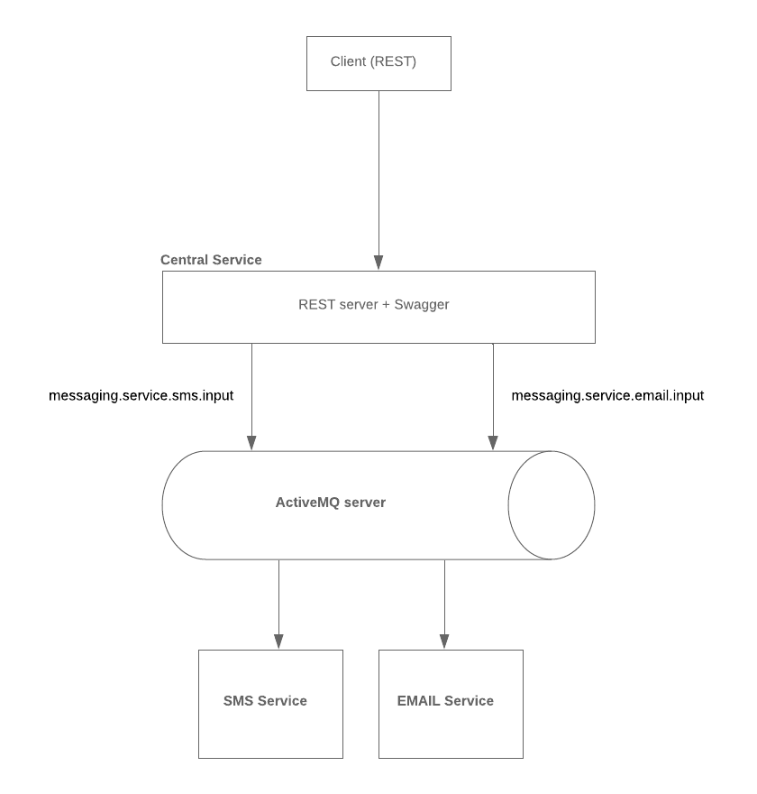

# Урок 2 - Сервис уведомлений
## Что надо сделать
Необходимо создать 2 сервиса для рассылки уведомлений (email и push, например). Сделать над ними универсальный интерфейс

## Технологии и запуск
Технологии: Java 8 + Spring Boot 2 + Swagger + ActiveMQ

Получение исходников и запуск приложения в docker:
```
git clone https://github.com/domavoy/otus-arch.git
cd otus-arch
cd lesson2


docker-compose build
docker-compose up
```

## Описание решения
Сервис предназначен для рассылки уведомлений.
Есть входная точка(REST) и отдельные микросервисы для рассылки СМС и  Email. Общение между ними идет через очередь (ActiveMQ)

Микросервисы:
* CentralService - входная точка. REST сервис.  
* EmailService - сервис для рассылки почтовых уведомлений
* SmsService -  сервис для рассылки СМС




#### Логика работы
* central-service получает запрос от пользователя. Он может вызывать или отправку СМС(sendSms) или отправку почты(sendEmail). Также пользователю возвращается UUID, по которому можно проверить статус запроса (функция getStatus)
* после этого сообщение кладется в очередь
  * Для СМС - messaging.service.sms.input
  * Для Email -  messaging.service.email.input
* Модули СМС/Email слушают свои очереди и выполняют свою работу. Интеграции с внешними сервисами нет - они просто пишут сообщение в свой лог.


#### Масштабирование и расширение
1) Для горизонтального масштабирования(например СМС) - нужно запустить еще один экземпляр sms-service. Он будут слушать и обрабаывать ту же очередь, что и первый.
2) Для добавления нового сервиса, например для отправки PUSH-ей, нужно:
* добавить новый метод в REST и класть сообщения в его очередь
* написать новый микросервис, который будет слушать эту очередь

## Пример вызова

* REST API для универсального интерфейса(SWAGGER) - http://localhost:8080/swagger-ui.html
* AMQ admin для просмотра очередей: http://localhost:8161/admin. Login\pw: admin/admin

## Если что то не работает
1) Если после запуска в docker, ссылка на swagger не работае, то скорее всего нужно обращаться с сервису по IP: https://blog.sixeyed.com/published-ports-on-windows-containers-dont-do-loopback/
2) Если же что то другое, то возможно проблема в различном окружении. Мне нужны будут логи:
- docker-compose logs
- docker-compose version
- docker version