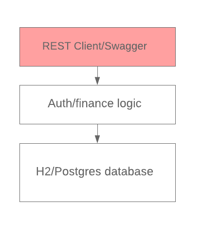
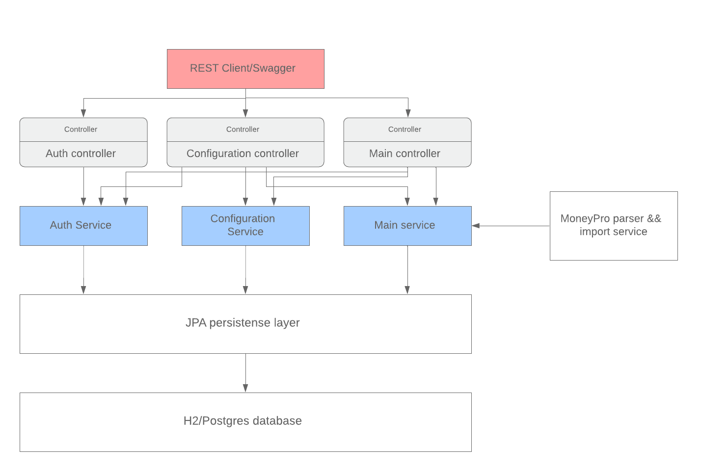

# Урок 3 - Домашняя бухгалтерия (микросервисы)
## Что надо сделать
Необходимо поделить ваше монолитное приложение на группу микросервисов

Монолит был сделан в [Уроке 1: ](../lesson1/readme.md)
```
Сервис предназначен для учета доходов и расходов, и вывода статистики по ним.
Также позволяет импортировать CSV данные из приложения MoneyPro (IOS) - https://money.pro/ru/iphone/
Пока есть только REST бэкенд
```

## Технологии и запуск
- Java 11 + Spring Boot 2 + Swagger + junit(60% coverage)
- Spring jpa
- h2/postgres

Получение исходников и запуск приложения в docker:
```
git clone https://github.com/domavoy/otus-arch.git
cd otus-arch
cd lesson3

docker-compose build
docker-compose up
```

REST сервисы:
- Auth-service swagger: http://localhost:8080/swagger-ui.html
- finance-service swagger: http://localhost:8081/swagger-ui.html
- budget-service swagger: http://localhost:8083/swagger-ui.html
- repeated-payment-service swagger: http://localhost:8082/swagger-ui.html
- scheduler-service swagger: http://localhost:8084/swagger-ui.html

## Описание решения
Было:



Стало:


В ДЗ1 был сделан монолит, и в нем было 3 базовых функции
- регистрация/вход пользователя (через получение сессии)
- настройка приложения - добавление счетов и категорий расходов
- добавление и просмотр расходов\доходов

В этом ДЗ я добавил несколько новых функций и поделил монолит на микросервисы.

#### 1) Выделил несколько пользовательских сценариев
- Регистрация и вход
- Настройка: добавление своих счетов и категорий расходов
- Добавление доходов/расходов и их получение
- Планирование расходов - добавление будущих расходов и их автоматический учет
- Бюджет: настройка бюджета по категориям на каждый месяц
- Автоматическое обновление курсов валют, каждый день

#### 2) После этого поделил приложение на несколько микросервисов
- Функции поделил на внутренние и внешние. Внутренние используются для общения между микросервисами. Внешние будут использоваться для будущего интерфейса.
- Функции, которые будут использоваться для интерфейса - принимают sessionId для проверки прав
- Каждый микросервис использует свою БД
- справочные данные пока передаются в виде строчек. В будущем можно для их отдачи можно сделать отдельные методы.

##### 3) Микросервисы
**3.1) auth-service** - авторизация и вход (http://localhost:8080/swagger-ui.html). 

Он позволяет создавать пользователя и получаться sessionId для вызова остальных сервисов. Другие сервисы при получении sessionId вызывают это сервис(/auth/getUserBySession(sessionId)) и получают id пользователя.

- сущности
    - User - пользователь. Содержит логин и пароль
    - Session - активные сессии для пользователей    
    
- операции
    - POST /auth/createUser(login, password) - создание пользователя.
    - POST /auth/checkUser(login,password) - проверка наличия пользователя в БД.
    - POST /auth/createSession(login, password) - создание сессионного ключа. Он используется для авторизации в других запросах.
    - (Internal) GET /auth/getUserBySession(sessionId) - получение юзера по сессии. Используется в scheduler-service
    - (internal) GET /auth/checkUserId(userId) - проверка по номеру. Используется в scheduler-service


**3.2) finance-service** - базовые операции (http://localhost:8081/swagger-ui.html). 

Тут есть два типа операций - настройка окружения пользователя(счета и категории расходов) и ввод+получение расходов/доходов. По идее можно микросервис на две части и поделить - но я не стал этого делать. 

- сущности
    - Account - счета. Например - наличка/кредитка, ...
    - Category - статья расходов. Например - еда/автомобиль/аренда, .. У каждого счета есть тип - это доход или расход
    - Transaction - собственно список доходов/расходов и переводов между счетами.
    - Currency - валюты и курсы
    
- операции
    - POST /config/addAccount(sessionId, RUB/USD/EUR, name) - добавления нового счета
    - GET /config/getAccounts(sessionId) - получение всех счетов
    - POST /config/addCategory(sessionId, INCOME/EXPENSE, name) - добавление новой статьи расходов
    - GET /config/getCategories(sessionId) - получение списка статей расходов
    - (internal) GET /config/createOrUpdateCurrency(currency, rate) - создание или обновление курса валюты. Пока без даты.
    - (internal) GET /config/getCurrency(currency) - получение курса валюты. Пока без даты.
    
    - POST /main/addTransaction(sessionId, accountName, categoryName, money, comment) - добавление нового дохода/расхода
    - (internal) POST /main/addInternalTransaction(userId, accoundId, categoryId, money, comment) - добавление нового дохода/расхода
    - POST /main/accountMoneyTransfer(sessionId, fromAccount, toAccount, Money, comment) - перевод данных между счетами (пока только в одной валюте)
    - GET /main/getTransactions(sessionId, fromDate(2019-01-10)) - получение списка операций с указанной даты
    - GET /main/getAccountStat(sessionId) - получение статистики по счетам
    
**3.3) budget-service** - бюджет (http://localhost:8083/swagger-ui.html) 

Ввод бюджета по категориям на месяц. После этого в интерфейсе можно показать - уложились ли расходы в этом месяце "в бюджет".

- операции
    - POST /budget/addBudget(sessionId, categoryId, amount) - добавления бюджета для категории на месяц
    - POST /budget/updateBudget(sessionId, budgetId, categoryId, amount) - обновление бюджета
    - POST /budget/getBudget(sessionId) - получение списка бюджетов по категориям
    
**3.4) repeated-payment-service** - планирование расходов (http://localhost:8082/swagger-ui.html)

Сервис для добавления будущих доходов/расходов. Они могут быть как одиночные, так и повторяющиеся.

- операции
    - POST /repeatedPayment/addFuturePayment  (sessionId, accountId, categoryId, amount, date, comment) - добавление будущего расхода.
    - POST /repeatedPayment/addInfinitePayment(sessionId, accountId, categoryId, amount, date, comment, granularity) - добавление будущего бесконечного расхода с периодичностью в granularity(месяц/год) 
    - POST /repeatedPayment/addRepeatedPayment(sessionId, accountId, categoryId, amount, date, comment, granularity, start, end) - добавление будущего расхода с датой окончания
    
    - POST /repeatedPayment/updateRepeatedPayment(sessionId, accountId, categoryId, amount, date, comment, granularity, start, end) - обновление будущих операций
    - GET /repeatedPayment/deleteRepeatedPayment(sessionId, paymentId) - удаление будущей операции
    - (internal) GET /repeatedPayment/getForDate(date) - получение всех операций за указанный день. Используется в scheduler-service
    
**3.5) scheduler-service** -запускает задачи по расписанию (http://localhost:8084/swagger-ui.html)

Есть две операции и их можно запускать вручную через REST.

- операции
    - GET /scheduler/executeCurrencyUpload - обновление курса валют с сайта ЦБРФ. Получает курс валют и через financeService.createOrUpdateCurrency обновляет курс валют.
    - GET /scheduler/executeCreateRepeatedPayment - создание "будущих" платежей. Запускается каждую ночь и ищет через repeated-payment-service.getForDate сегодняшние расходы для всех юзеров. И для каждого расхода создает транзакцию: finance-service.addInternalTransaction

##### 4) Библиотеки:
Также есть несколько библиотек:
- auth-service-client: REST клиент для вызыова auth-service с остальных сервисов из Java
- services-common: общая логика для микросервисов

##### 5) что еще можно сделать
- авторизация: права доступа + gwt токены
- новые фичи: биллинг и промокоды ....
- масштабирование REST для auth-service. Так как много все сервисы, вызывает его.


## Пример вызова
После запуска приложения - автоматически запускается БД в памяти и создается пользователь с данными
- Логин - login
- Пароль - password

Чтобы кратко проверить:
1) Получаем сессию пользователя: auth/createSession
```
curl -X POST "http://localhost:8080/auth/createSession" -H "accept: application/json" -H "Content-Type: application/json" -d "{ \"login\": \"login\", \"passsword\": \"password\"}"
```
2) Далее сессия применяется в остальных пользовательских функциях:
```
curl -X GET "http://localhost:8081/main/getTransactions?fromDate=2010-10-10&sessionId=1672516039827669681" -H "accept: application/json"
```


## Если что-то не работает
1) Если после запуска в docker, ссылка на swagger не работает, то скорее всего нужно обращаться с сервису по IP: https://blog.sixeyed.com/published-ports-on-windows-containers-dont-do-loopback/
2) Если же что то другое, то возможно проблема в различном окружении. Мне нужны будут логи:
- docker-compose logs
- docker-compose version
- docker version