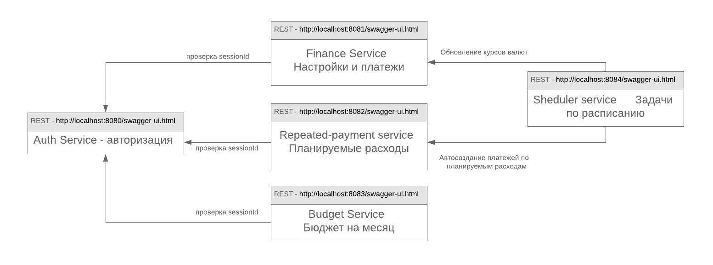

# Урок 3 - Домашняя бухгалтерия (микросервисы)
## Что надо сделать
Необходимо поделить ваше монолитное приложение на группу микросервисов

Монолит был сделан в [Уроке 1](../lesson1/readme.md)
Сервис предназначен для учета доходов и расходов, и вывода статистики по ним.
Также позволяет импортировать CSV данные из приложения MoneyPro (IOS) - https://money.pro/ru/iphone/
Пока есть только REST бэкенд

## Технологии и запуск
- Java 11 + Spring Boot 2 + Swagger + junit(60% coverage)
- Spring jpa
- h2/postgres

Получение исходников и запуск приложения в docker:
```
git clone https://github.com/domavoy/otus-arch.git
cd otus-arch
cd lesson3

docker-compose build
docker-compose up
```

REST сервисы:
- auth-service swagger: http://localhost:8080/swagger-ui.html
- finance-service swagger: http://localhost:8081/swagger-ui.html
- budget-service swagger: http://localhost:8082/swagger-ui.html
- repeated-payment-service swagger: http://localhost:8083/swagger-ui.html
- scheduler-service swagger: http://localhost:8084/swagger-ui.html

## Описание решения
//TODO: как что вызывается глобально
//TODO: более локальная картинка


В ДЗ1 был сделан монолит, и в нем было 3 базовых функции
- регистрация/вход пользователя (через получениия сессии)
- настройка приложения - добавление счетов и категорий расходов
- добавление и просмотр расходов\доходов

В этом ДЗ я добавил несколько новых функций и поделил монолит на микросервисы.

#### Выделил несколько пользовательских сценариев
- Регистрация и вход
- Настройка: добавление своих счетов и категорий расходов
- Добавление доходов/расходов и их получение
- Планирование расходов - добавление будущих расходов и их автоматический учет
- Бюджет: настройка бюджета по категориям на каждый месяц
- Автоматическое обновление курсов валют, каждый день

#### TODO: После этого поделил приложение на несколько микросервисов
Также функции поделил на внутренние и внешние. Внутренние используются для общения между микросервисами. Внешние будут использоваться для будущего интерфейса.

- auth-service - авторизация и вход (http://localhost:8080/swagger-ui.html)
    - POST /auth/createUser(login, password) - создание пользователя.
    - POST /auth/checkUser(login,password) - проверка наличия пользователя в БД.
    - POST /auth/createSession(login, password) - создание сессионного ключа. Он используется для авторизации в других запросах.
    - (Internal) GET /auth/getUserBySession(sessionId) - получение юзера по сессии
    - (internal) GET /auth/checkUserId(userId) - проверка по номеру

- finance-service - базовые операции (http://localhost:8081/swagger-ui.html)
    - POST /config/addAccount(sessionId, RUB/USD/EUR, name) - добавления нового счета
    - GET /config/getAccounts(sessionId) - получение всех счетов
    - POST /config/addCategory(sessionId, INCOME/EXPENSE, name) - добавление новой статьи расходов
    - GET /config/getCategories(sessionId) - получение списка статей расходов
    
    - POST /main/addTransaction(sessionId, accountName, categoryName, money, comment) - добавление нового дохода/расхода
    - POST /main/addInternalTransaction(userId, accoundId, categoryId, money, comment) - добавление нового дохода/расхода
    - POST /main/accountMoneyTransfer(sessionId, fromAccount, toAccount, Money, comment) - перевод данных между счетами (пока только в одной валюте)
    - GET /main/getTransactions(sessionId, fromDate(2019-01-10)) - получение списка операций с указанной даты
    - GET /main/getAccountStat(sessionId) - получение статистики по счетам
    
- budget-service (http://localhost:8083/swagger-ui.html)
    - POST 
- repeated-payment-service (http://localhost:8082/swagger-ui.html)
    - GET ...
- scheduler-service ((http://localhost:8084/swagger-ui.html))
    - GET ...

TODO: Также есть несколько библиотек:
- auth-service-client
- services-common

#### почему так сделал
#### что еще можно сделать
- авторизация: права доступа + gwt токены
- новые фичи: биллинг и промокоды
- масштабирование REST для auth (большая нагрузка)
    - несколько серверов
    - api => amq => logic для авторизации


## TODO: Описание сервисов
#### auth-service
- описание и логика
- сущности
    - User - пользователь. Содержит логин и пароль
    - Session - активные сессии для пользователей    
- связь с другими сервисами
- структура БД    
```
create table if not exists "user"
(
	id integer not null
	login varchar(100) not null,
	password varchar(100) not null
);

create table currency
(
	id integer not null
	name varchar(100),
	is_default boolean,
	rate numeric(16,2)
);

create table if not exists account
(
	id integer not null
	user_id integer,
	currency_id integer,
	name varchar(100),
	amount numeric(16,2)
);
```
    
#### finance-service
- описание и логика
- сущности
    - Account - счета. Например - наличка/кредитка, ...
    - Category - статья расходов. Например - еда/автомобиль/аренда, .. У каждого счета есть тип - это доход или расход
    - Transaction - собственно список доходов/расходов и переводов между счетами.
- связь с другими сервисами
- структура БД
```
create table if not exists category
(
	id integer not null
	user_id integer,
	transaction_type integer,
	name varchar(100)
);

create table if not exists session
(
	id integer not null
	user_id integer,
	session_id bigint,
	status integer
);

create table if not exists transaction
(
	id integer not null
	user_id integer,
	transaction_type integer,
	date date,
	account_id integer,
	amount numeric(16,2),
	to_account_id integer,
	to_amount numeric(16,2),
	category_id integer,
	comment varchar(100)
);
```    
    
#### budget-service
- описание и логика
- сущности
- связь с другими сервисами
    
#### repeated-payment-service
- описание и логика
- сущности
- связь с другими сервисами
    
#### scheduler-service
- описание и логика
- сущности
- связь с другими сервисами


## API - кратко
- Auth-service swagger: http://localhost:8080/swagger-ui.html
- finance-service swagger: http://localhost:8081/swagger-ui.html
- budget-service swagger: http://localhost:8082/swagger-ui.html
- repeated-payment-service swagger: http://localhost:8083/swagger-ui.html
- scheduler-service swagger: http://localhost:8084/swagger-ui.html

После запуска приложения - автоматически запускается БД в памяти и создается пользователь с данными
- Логин - login
- Пароль - password

Чтобы кратко проверить:
1) Получаем сессию пользователя: auth/createSession
```
curl -X POST "http://localhost:8080/auth/createSession" -H "accept: application/json" -H "Content-Type: application/json" -d "{ \"login\": \"login\", \"passsword\": \"password\"}"
```
2) Далее сессия применяется в остальных пользовательских функциях:
```
curl -X GET "http://localhost:8080/main/getTransactions?fromDate=2010-10-10&sessionId=1672516039827669681" -H "accept: application/json"
```


## Если что то не работает
1) Если после запуска в docker, ссылка на swagger не работает, то скорее всего нужно обращаться с сервису по IP: https://blog.sixeyed.com/published-ports-on-windows-containers-dont-do-loopback/
2) Если же что то другое, то возможно проблема в различном окружении. Мне нужны будут логи:
- docker-compose logs
- docker-compose version
- docker version